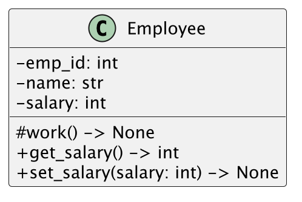
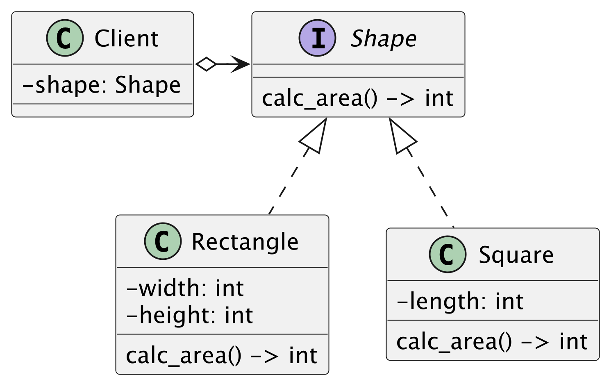

## 演習 1

次のクラス図を Python で実装してください

メソッドの仕様

- work メソッドは"働きます"とログ出力します
- get_salary メソッドは属性の salary を返却します
- set_salary メソッドは引数の salary を属性の salary に代入します

## 演習 2

次のクラスを Python で実装してください

メソッドの仕様

- Rectangle の面積は wide と height の掛け算で算出します
- Square の面積は length \* length で算出します
